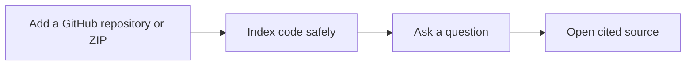

# Codebase Intelligence

Ask plain-language questions about a repository, then open the exact source behind every finding.

> **Project status:** `0.3.0` beta. The local workflow is ready for evaluation and contribution.
> Review the [security boundary](SECURITY.md) before using private code or exposing the app on a
> network.

## The core workflow



Codebase Intelligence combines Tree-sitter code parsing, LlamaIndex, Qdrant, FastAPI, and a
Streamlit workbench. Imported code is treated as untrusted text and is never executed.

- Import a public or private GitHub repository, or upload a ZIP.
- Find code by meaning, path, symbol, and content.
- Get file, symbol, and line citations with every result.
- Open the redacted indexed source directly from a citation.
- Run without provider credentials, or opt in to Voyage AI and OpenAI.

## Start locally

You need Python 3.12, [uv](https://docs.astral.sh/uv/), Make, and Git.

From the project checkout, run:

```bash
make demo
```

This installs the locked dependencies and starts the API and interface in one terminal with
credential-free defaults. Open <http://127.0.0.1:8501>. Press `Ctrl+C` to stop both processes.

Then:

1. In **Add your first repository**, choose a source.
2. Paste a public GitHub URL, or choose **ZIP upload**.
3. Wait until indexing is ready and ask from **Ask**.
4. Open a citation to inspect it in **Source**.

Try: “Where is the authentication logic?” or “How does the payment flow work?”

For a guided first run using the bundled sample, read
[Getting started](docs/getting-started.md).

## Docker alternative

You need Docker with the Compose plugin.

```bash
docker compose config --quiet
make compose-up
```

Open <http://127.0.0.1:8501>. Stop the stack without deleting its named volumes:

```bash
make compose-down
```

## Provider choices

The default is local, deterministic, and credential-free. It is useful for setup and development;
paid providers generally produce stronger semantic retrieval or smoother explanations.

| Goal | Embeddings | Answer | Credential |
|---|---|---|---|
| Local demo | `deterministic` | `extractive` | None |
| Code-focused retrieval | `voyage` | `extractive` | `VOYAGE_API_KEY` |
| Retrieval plus synthesis | `voyage` | `openai` | Voyage and OpenAI keys |
| OpenAI-only stack | `openai` | `openai` | `OPENAI_API_KEY` |

Copy `.env.example` only when you want persistent local settings:

```bash
cp .env.example .env
```

Keep `.env` private. See [Getting started](docs/getting-started.md#optional-provider-setup) for the
smallest provider-specific changes. Reindex repositories after changing the embedding provider,
model, dimension, parser contract, or chunk settings.

## Safety boundary

The app bounds, filters, redacts, parses, and retrieves repository text. It does not run imported
code, hooks, builds, package managers, or tests. GitHub URLs are restricted to canonical
`github.com/owner/repository` addresses, and ZIP extraction rejects common traversal and archive
abuse.

Redaction is defense in depth, not a guarantee that all sensitive text is detected. Before using an
external provider, confirm that sending source-derived text is allowed by your repository and
provider policies.

This beta is designed for a trusted local or single-user boundary. It does not include user
accounts, tenant isolation, TLS termination, a distributed rate limiter, or a managed secret
store. Read the [security policy](SECURITY.md) and [threat model](docs/security/threat-model.md)
before handling private code or deploying beyond loopback.

## Extend the project

Start with [Extending Codebase Intelligence](docs/development/extending.md). It maps the in-tree
seams for:

- languages and Tree-sitter symbol rules;
- embedding and answer providers;
- repository source types;
- API routes; and
- Streamlit views and client calls.

External entry-point plugins are not supported yet. Extensions currently require a source change
and tests in this repository.

## Useful commands

| Command | Purpose |
|---|---|
| `make demo` | Install dependencies and start the local app |
| `make test` | Run deterministic tests |
| `make check` | Run lint, types, security, tests, and coverage |
| `make api` | Start only FastAPI |
| `make worker` | Start only the external ingestion worker |
| `make ui` | Start only Streamlit |
| `make compose-up` | Build and start the container stack |
| `make compose-down` | Stop containers without deleting data |

## Documentation

- [Documentation map](docs/README.md)
- [Getting started](docs/getting-started.md)
- [Architecture](docs/architecture/overview.md)
- [API reference](docs/api/reference.md)
- [Operations](docs/operations/runbook.md)
- [Contributing](CONTRIBUTING.md)
- [Support](SUPPORT.md)
- [Changelog](CHANGELOG.md)

## License

Codebase Intelligence is available under the [MIT License](LICENSE).
