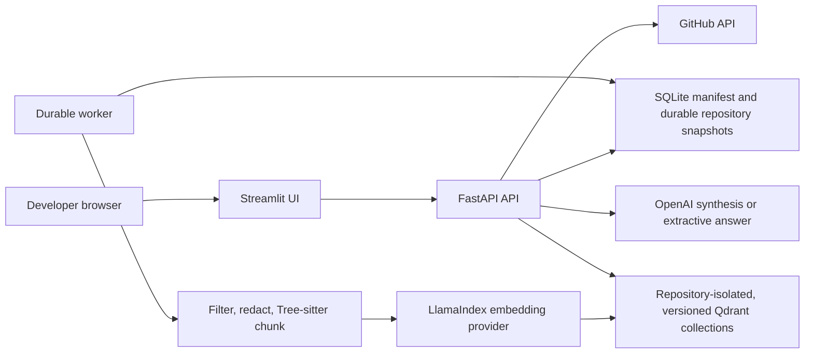

# Codebase Intelligence

Codebase Intelligence is a repository-scoped RAG application for questions such as “Where is the authentication logic?” and “How does the payment flow work?” It accepts a GitHub repository or ZIP archive, parses supported source with Tree-sitter, indexes line-accurate chunks through LlamaIndex and Qdrant, and returns answers with file, symbol, and line citations.

The project combines a FastAPI system of record, a durable ingestion worker, and a Streamlit interface. Repository content is always treated as untrusted data: it is bounded, filtered, redacted, parsed, and retrieved, but never executed.

## What it does

- Imports public or private GitHub repositories and local ZIP archives.
- Recognizes symbols across common programming languages with Tree-sitter and falls back to deterministic line chunks for prose, configuration, or unsupported grammars.
- Uses Voyage AI code embeddings, OpenAI embeddings, or a credential-free deterministic embedding.
- Builds immutable, versioned Qdrant collections inside an isolated repository namespace and
  publishes exactly one persisted collection as the active index.
- Synthesizes grounded answers with OpenAI or returns ranked extractive evidence without an answer-model credential.
- Preserves source path, symbol, language, line range, score, commit SHA, and GitHub permalink metadata.
- Exposes versioned APIs, durable job progress, reindex, queued-job cancellation, and synchronous
  deletion with vector/filesystem readback plus an acknowledged manifest delete commit.

## Credential-free demo

Prerequisites are Python 3.12, [uv](https://docs.astral.sh/uv/), and a POSIX-like shell. This path uses deterministic embeddings, extractive answers, embedded Qdrant, and the bundled fixture; it makes no paid-provider call.

Install the locked dependencies and start the API in terminal 1:

```bash
make sync
CODEBASE_INTEL_EMBEDDING_PROVIDER=deterministic \
CODEBASE_INTEL_ANSWER_PROVIDER=extractive \
CODEBASE_INTEL_INLINE_WORKER=true \
make api
```

Start Streamlit in terminal 2:

```bash
CODEBASE_INTEL_API_BASE_URL=http://127.0.0.1:8000 make ui
```

Create a safe sample ZIP:

```bash
python -m zipfile -c /tmp/codebase-intelligence-sample.zip tests/fixtures/sample_repo
```

Open `http://127.0.0.1:8501`, choose **ZIP archive**, upload the sample, wait for the job to reach **ready**, and ask:

- `Where is the authentication logic?`
- `How does the payment flow work?`

Extractive mode intentionally lists the strongest cited locations instead of inventing a prose explanation. It is a useful local demonstration, not a semantic-quality benchmark for Voyage or OpenAI embeddings.

## API quickstart

With the demo API running, upload the same fixture directly:

```bash
curl --fail-with-body --silent --show-error \
  --request POST \
  --form file=@/tmp/codebase-intelligence-sample.zip \
  --form name=sample-repository \
  http://127.0.0.1:8000/api/v1/repositories/upload
```

The API returns `202 Accepted` with `repository_id`, `job_id`, and `status`. Poll the returned job until it succeeds:

```bash
JOB_ID=replace-with-returned-job-id
curl --fail-with-body --silent --show-error \
  http://127.0.0.1:8000/api/v1/jobs/${JOB_ID}
```

Then ask a question:

```bash
REPOSITORY_ID=replace-with-returned-repository-id
curl --fail-with-body --silent --show-error \
  --request POST \
  --header 'Content-Type: application/json' \
  --data '{"question":"Where is the authentication logic?","top_k":8}' \
  http://127.0.0.1:8000/api/v1/repositories/${REPOSITORY_ID}/questions
```

If `CODEBASE_INTEL_API_KEY` is configured, add `X-API-Key` to every request except `/`, liveness,
and readiness. Built-in Swagger/ReDoc and the default public schema route are disabled; authenticated
tooling can read `GET /api/v1/openapi.json` through the same protected router. See the
[API reference](docs/api/reference.md) for the full contract.

## Provider setup

Copy the example only when you want persistent local configuration:

```bash
cp .env.example .env
```

Keep `.env` private. It is ignored by Git, but a production deployment should inject credentials through its secret manager instead of a file or image layer.

| Use case | Embedding provider | Answer provider | Required credentials |
|---|---|---|---|
| Offline demo and tests | `deterministic` | `extractive` | None |
| Code-focused retrieval | `voyage` | `extractive` | `VOYAGE_API_KEY` |
| Code-focused retrieval and synthesis | `voyage` | `openai` | `VOYAGE_API_KEY`, `OPENAI_API_KEY` |
| OpenAI-only stack | `openai` | `openai` | `OPENAI_API_KEY` |

### Voyage AI embeddings

Set these values in `.env` or your process secret store:

```dotenv
CODEBASE_INTEL_EMBEDDING_PROVIDER=voyage
CODEBASE_INTEL_VOYAGE_EMBEDDING_MODEL=voyage-code-3
VOYAGE_API_KEY=replace-in-a-private-secret-store
```

Voyage embeddings can be paired with `CODEBASE_INTEL_ANSWER_PROVIDER=extractive` so no chat-model credential is needed.

### OpenAI embeddings and answers

```dotenv
CODEBASE_INTEL_EMBEDDING_PROVIDER=openai
CODEBASE_INTEL_OPENAI_EMBEDDING_MODEL=text-embedding-3-small
CODEBASE_INTEL_ANSWER_PROVIDER=openai
CODEBASE_INTEL_OPENAI_CHAT_MODEL=gpt-5-mini
OPENAI_API_KEY=replace-in-a-private-secret-store
```

Changing the embedding provider/model/dimension, Tree-sitter package contract, secret-redaction or
hybrid-rerank contract, Qdrant collection prefix, or chunk settings changes the index fingerprint.
Reindex existing repositories before querying them with the new configuration.

`GET /api/v1/status` reports the configured embedding and answer provider/model plus whether each
runtime path initialized successfully. `GET /api/v1/health/ready` requires all three applied SQLite
migrations, an operational embedding path, and a successful Qdrant health check. When this process
is configured to own the inline worker, readiness also requires its task to exist and remain
running. The endpoint does not prove a separately supervised external worker, job progress, or
optional OpenAI synthesis. Inspect job state and the separately reported answer provider instead of
flattening those signals into one green result.

## Import a repository

### Public GitHub repository

In Streamlit, choose **GitHub repository** and enter a canonical URL such as `https://github.com/owner/repository`. An optional branch, tag, or commit ref can be supplied. The API accepts only `github.com/<owner>/<repository>` and fetches archives through fixed `api.github.com` endpoints.

The equivalent API request is:

```bash
curl --fail-with-body --silent --show-error \
  --request POST \
  --header 'Content-Type: application/json' \
  --data '{"url":"https://github.com/owner/repository","ref":"main"}' \
  http://127.0.0.1:8000/api/v1/repositories
```

### Private GitHub repository

Use the Streamlit token field or send a least-privilege token in the request-only `X-GitHub-Token`
header. The token is used by the API to acquire the archive and is not included in the queued job,
SQLite manifest, source URL, worker configuration, logs, or vector payloads. The external worker
processes the already-downloaded archive from the durable repository directory and never receives
that token.

Do not put a token in the GitHub URL, JSON body, query string, `.env` committed to source control, or command history. Prefer a short-lived fine-grained token and a client that can supply headers without exposing values in process arguments.

### ZIP archive

Upload a `.zip` through Streamlit or `POST /api/v1/repositories/upload`. Archives are inspected before extraction. Absolute paths, traversal, symlinks, devices, encrypted entries, excessive nesting, too many files, oversized members, excessive expansion, and disallowed file types are rejected.

## Architecture



FastAPI is the only product boundary used by Streamlit. After an archive has been durably moved
into its repository directory, SQLite inserts the repository and ingest job in one transaction.
Starting a reindex likewise moves the repository to `indexing` and inserts its job atomically. A
partial unique index permits at most one `queued` or `running` job per repository, while retaining
terminal job history.

Workers claim jobs transactionally and use a lease-only heartbeat; renewing a lease cannot replay
or overwrite stage/progress. Indexing builds a new versioned Qdrant collection without touching the
persisted active collection. A successful build publishes the new collection name, index
fingerprint, repository `ready` state, and job success in one SQLite transaction, then removes old
versions best-effort. Collection discovery uses the repository UUID marker across configured-prefix
changes, so startup, post-publish cleanup, and deletion can find historical versions. A failed build
attempts best-effort cleanup of only its unpublished version and never removes the active one. A
terminal failed
reindex atomically fails the job and restores the repository to `ready` only when its last
successfully published collection still exists; otherwise terminal failure marks the repository
`failed`.

Questions require a `ready` repository, a persisted collection name, and an index fingerprint that
matches the complete running index contract. Search targets that exact persisted
collection only after confirming it physically exists; an absent published collection returns
`INDEX_MISSING` and requires reindexing. Every returned payload must contain the requested
repository ID. Citations are assembled from retrieved metadata independently of model prose.

Local development defaults to an inline worker and embedded Qdrant. Docker Compose runs API, worker, UI, and Qdrant Server as separate processes. The UI is the only host-published service; API and Qdrant remain private to container networks. See the [architecture overview](docs/architecture/overview.md) for state and failure details.

## Docker Compose

The Compose default is intentionally credential-free and local-only:

```bash
docker compose config
make compose-up
docker compose ps
```

Open `http://127.0.0.1:8501`. Persistent state lives in the named volumes `codebase-intelligence-data`, `codebase-intelligence-qdrant`, and `codebase-intelligence-qdrant-snapshots`. `make compose-down` stops services without deleting those volumes.

To use a paid provider, supply the corresponding environment values before `docker compose up`. The API and worker need provider credentials for their respective operations; the private GitHub token remains request-scoped and is never passed to the worker.

The image is multi-stage and runs as UID/GID `10001`, with a read-only root filesystem in Compose, all Linux capabilities dropped, `no-new-privileges`, bounded process counts, and writable storage limited to named volumes and `tmpfs`.

## Safety limits

Defaults are conservative and configurable through `CODEBASE_INTEL_*` settings:

| Boundary | Default |
|---|---:|
| Downloaded archive | 100 MiB |
| Extracted archive | 500 MiB |
| Archive expansion ratio | 100x |
| Archive or repository files | 25,000 |
| Individual file | 2 MiB |
| Total indexable bytes | 200 MiB |
| Generated chunks | 100,000 |
| Path depth | 40 components |
| Path length | 1,024 characters |
| Question length | 4,000 characters |
| Retrieval `top_k` | 20 maximum |

Dependency, build, cache, VCS, binary, source-map, certificate, private-key, and `.env*` surfaces are excluded. Text secret redaction is defense in depth, not a guarantee that all proprietary or sensitive content is detected. Review repository policy before sending any source-derived text to an external embedding or answer provider.

## Security boundaries

This application does not execute, import, build, test, or run uploaded repository code. It does not follow repository hooks or arbitrary URLs. Retrieved source remains untrusted even when passed to the answer model, and generated citation IDs are validated against the retrieved source set.

The application is not a complete public multi-tenant security perimeter. It does not provide user accounts, per-tenant authorization, quotas, a distributed rate limiter, TLS termination, malware scanning, egress policy, or a managed secret store. Before exposing it beyond a trusted local network, place it behind authenticated TLS ingress, isolate tenants, restrict egress, configure `CODEBASE_INTEL_API_KEY`, add request/rate controls, monitor storage, and establish backup and deletion policies.

Read [SECURITY.md](SECURITY.md) and the [threat model](docs/security/threat-model.md) before indexing private code.

## Developer commands

| Command | Purpose |
|---|---|
| `make sync` | Verify the lock and install all dependency groups |
| `make test` | Run deterministic non-live tests |
| `make coverage` | Run branch coverage with the 80% gate |
| `make lint` | Run Ruff lint checks |
| `make format-check` | Verify Ruff formatting |
| `make typecheck` | Run strict mypy |
| `make security` | Run Bandit and pip-audit |
| `make check` | Run the complete local gate |
| `make api` | Start FastAPI |
| `make worker` | Start the external worker |
| `make ui` | Start Streamlit |
| `make compose-up` | Build and start the Compose stack |
| `make compose-down` | Stop the stack without deleting data |

Contributions should follow [CONTRIBUTING.md](CONTRIBUTING.md).

## Proof boundaries

The repository includes deterministic unit/integration tests, 15 Streamlit UI/client state and
interaction tests, security regression cases, CI configuration, and local container definitions.
The branch-coverage denominator intentionally omits `src/codebase_intelligence/ui/app.py` because
Streamlit AppTest executes that script in an untraced script-runner context. The 80% source gate and
the UI suite are therefore complementary evidence, not one combined coverage claim.

The final integrated localhost proof used the real FastAPI app, inline worker, SQLite, embedded
Qdrant, deterministic embeddings, and extractive answers. Because the in-app browser could not
drive the native file chooser, the fixture ZIP was submitted through the real API rather than the
browser upload control; the worker indexed 6 files into 12 chunks with 1 redaction. The desktop UI
then rendered cited authentication and payment answers with exact files, symbols, and lines, and a
real reindex moved through queued/indexing back to `ready`. The 390×844 mobile layout and cited
payment answer also passed. The final clean desktop run had no console warnings/errors; a mobile
reindex rerender emitted one user-invisible upstream Streamlit wavesurfer `Container not found`
console error, so mobile is not claimed console-clean.

That integrated flow complements, but does not replace, the mock-backed UI/client state tests or
the source coverage gate. It does not prove browser-driven file selection, paid-provider quality,
private-GitHub access, Docker runtime, hosted-dev, or production behavior.

Results produced on localhost or in CI prove only those exercised environments and inputs. They do
not prove provider quality, private-repository access, cloud networking, hosted availability,
production security, backup recovery, or operational readiness unless those layers are separately
run and recorded.

No hosted-dev or production deployment is claimed by this README. Use the [operations runbook](docs/operations/runbook.md) to validate a target environment and retain its own evidence.

## Documentation

- [Architecture overview](docs/architecture/overview.md)
- [API reference](docs/api/reference.md)
- [Operations runbook](docs/operations/runbook.md)
- [Security threat model](docs/security/threat-model.md)
- [Implementation plan](docs/superpowers/plans/2026-07-17-codebase-intelligence.md)

## License

Codebase Intelligence is available under the [MIT License](LICENSE).
