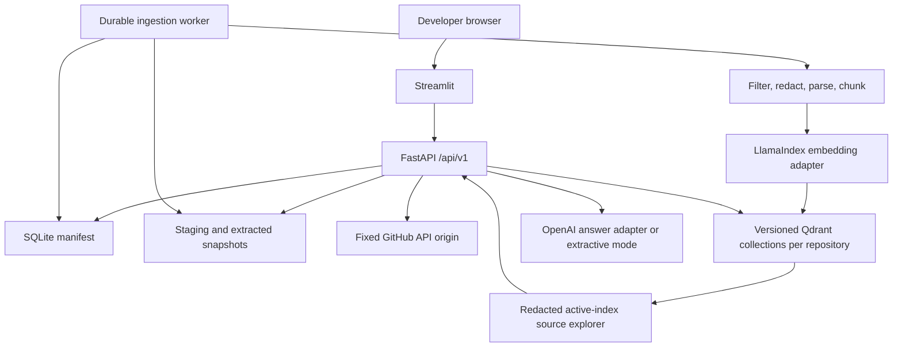
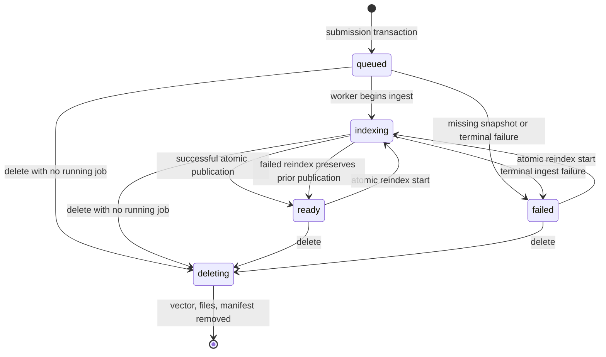
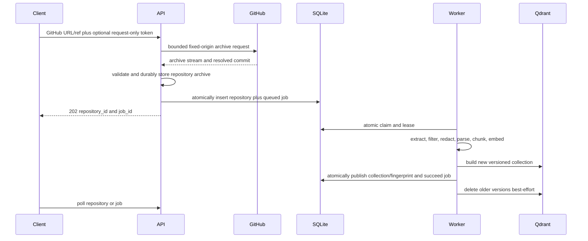

# Architecture Overview

## Purpose

Codebase Intelligence turns one GitHub repository or ZIP archive into a repository-scoped retrieval index and answers questions with exact source locations. The design favors bounded untrusted-input handling, durable asynchronous work, explicit provider configuration, and evidence that remains useful when answer synthesis is disabled.

## System context

Streamlit does not read SQLite, repository files, Qdrant, GitHub, or model providers directly. FastAPI owns the public product contract and composes settings, persistence, job coordination, source acquisition, retrieval, answer generation, and lifecycle cleanup.

## Components

### FastAPI

The API exposes liveness/readiness, provider status, repository creation and lifecycle operations, durable jobs, questions, and repository-scoped indexed-source exploration. It performs request validation, request-ID propagation, optional `X-API-Key` authentication, conservative CORS, bounded uploads, exception-to-problem mapping, and synchronous delete orchestration.

For a private GitHub source, the API receives `X-GitHub-Token` and uses it only for acquisition. It
moves the downloaded archive into the durable repository directory before inserting a token-free
repository/job pair. The job payload contains neither the token nor a filesystem path; the worker
derives the private snapshot location from the persisted repository ID.

### SQLite manifest

SQLite is the system of record for repositories and jobs. WAL mode, explicit transactions, legal
state transitions, atomic claims, leases, attempts, and timestamps allow a worker to recover work
without an in-memory queue. Lifecycle operations that span both tables use one transaction:

- after an archive is durable, submission inserts the repository and its ingest job together;
- reindex moves a `ready` or `failed` repository to `indexing` and inserts its job together;
- successful publication stores the active collection/fingerprint and moves the repository to
  `ready` while succeeding the live leased job; and
- terminal processing failure atomically fails the live leased job and either restores a physically
  present prior reindex collection or marks the repository failed.

Migration 3 adds a partial unique index on `jobs(repository_id)` for rows whose status is `queued`
or `running`. Consequently, one repository can retain any number of terminal jobs but can have at
most one active job. SQLite and repository snapshots share the application data volume; this
topology assumes a single host and a filesystem with correct local locking semantics.

### Worker

The worker polls SQLite, claims one eligible job with a lease, updates stage/progress, and records
terminal success or a sanitized failure. Its periodic heartbeat calls the lease-only renewal path:
it extends `lease_expires_at` for the current owner but cannot replay a stale stage or progress
value. Stage/progress updates remain separately worker-owned and monotonic. Ingestion work is
deterministic until the embedding boundary:

1. read the already-downloaded archive or immutable extracted snapshot;
2. safely extract when needed;
3. apply path, type, size, ignore, binary, vendor, build, and sensitive-file filters;
4. redact secret-shaped text without changing original line numbering;
5. parse supported languages and create symbol chunks;
6. create deterministic fallback chunks when parsing is unavailable or fails;
7. embed nodes with repository, path, symbol, parser, line, hash, and commit metadata; and
8. build a fresh versioned Qdrant collection without changing the active manifest;
9. atomically publish its collection name/fingerprint and succeed the job; and
10. remove older repository collection versions after publication.

The worker does not expose a network API and does not receive a GitHub token. Its container health check is process liveness; queue progress and stale leases must be monitored through the jobs API.

### Tree-sitter chunking

Tree-sitter byte and point ranges are the source of truth for supported code symbols. Complete class, function, method, interface, struct, and module nodes are preferred. Oversized nodes split into bounded line windows that preserve the parent symbol. Unsupported grammars, configuration, prose, and parser failures use overlapping deterministic line windows.

Redaction preserves newline count, so a citation's `start_line` and `end_line` continue to address the original source file even when an indexed secret-shaped value was replaced.

### LlamaIndex providers

Provider factories are explicit dependencies rather than mutations of LlamaIndex globals:

- Voyage AI `voyage-code-3` is the default code-focused embedding configuration.
- OpenAI `text-embedding-3-small` is the alternative embedding configuration.
- A deterministic lexical hash embedding exists only for tests and an explicitly labeled demo.
- OpenAI `gpt-5-mini` can synthesize a cited explanation.
- Extractive mode returns ranked cited locations without a chat-model credential.

Embedding provider/model/dimension, the Tree-sitter package contract, secret-redaction and
hybrid-rerank contract versions, Qdrant collection prefix, and chunk configuration contribute to an
index fingerprint. The query path compares the running fingerprint with the fingerprint persisted
beside the active collection name. A missing collection name or mismatch requires reindexing rather
than querying incompatible vectors.

### Qdrant

Every repository gets a namespace derived from its opaque repository ID. Each build writes an
immutable physical collection with a random version suffix; collection APIs are not exposed without
a repository ID, and retrieved payloads are checked for matching repository metadata. Discovery
matches the repository UUID marker across configured collection-prefix histories, so changing the
prefix does not hide an older physical version. The manifest is the authority for which version is
active.

A failed build attempts best-effort deletion of only the unpublished partial collection; cleanup
failure is logged and startup reconciliation can later prune the inactive version. A successful
build is first published through the SQLite lifecycle transaction; older versions are deleted
afterward on a best-effort basis. Thus, a terminal failed reindex can return to `ready` with the last
published collection only after physical readback, while startup reconciliation can prune inactive
versions left by a crash. Repository deletion enumerates and removes every version in the
repository namespace, not just the currently published collection.

Embedded Qdrant is suitable for the single-process local mode. API and worker processes require Qdrant Server so both observe the same vector state.

### Indexed-source explorer

The source explorer uses the manifest's active `collection_name` as its only catalog. After the same readiness, fingerprint, physical-collection, and repository-scope checks used by questions, it scrolls bounded Qdrant payloads and reconstructs their LlamaIndex nodes. File summaries group those nodes by repository-relative path; a detail request returns ordered, line-aware sections for one exact path.

This design deliberately avoids a second SQLite source catalog. Atomic collection publication already defines the index version, so citations and previews observe the same redacted payloads without a dual-write or migration boundary. The explorer never opens the immutable archive or extracted snapshot. Those raw bytes remain worker input and may contain values that redaction removed before indexing.

### Streamlit

The UI is an API client organized as a repository workbench. It supports secondary GitHub and ZIP onboarding, request-scoped private tokens, job progress, repository selection, Investigate/Explore/Overview/Manage views, repository-scoped session history, citation-to-source navigation, Markdown export, reindex, and confirmed delete. It renders API problem details only after client-side sanitization. Runtime/provider diagnostics are disclosure content rather than the primary workflow, and ready workspaces do not poll the entire question surface.

## Lifecycle state

Jobs independently move through `queued`, `running`, `succeeded`, `failed`, or `cancelled`, with
stages from acquisition through indexing. The partial unique index makes `queued` and `running` one
shared active set per repository. Repository and job transitions are validated rather than inferred
from UI state. Deletion rejects a repository with a running job before changing its state; it may
cancel queued work under the repository operation lock.

## Ingestion sequence

ZIP ingestion begins at bounded multipart upload and follows the same durable-archive boundary. Reindex uses
the existing immutable archive or extracted snapshot; it does not silently refetch a moving GitHub
branch. Reindex initiation and the one-active-job invariant are committed before `202` is returned.

## Recovery and reconciliation

The worker recovers expired running leases when it starts and before claims. Work below the attempt
limit returns to `queued`; exhausted work and its `queued`/`indexing` repository become `failed`.
Stale recovery deliberately does not trust a persisted collection-name string without Qdrant
readback. An operator can explicitly reindex a failed repository from its immutable snapshot. Lease
renewal itself changes only expiry and update time.

Every application-container startup with an initialized ingestion service also reconciles durable
manifests and storage under per-repository locks. In inline mode this completes before the worker
task starts; service-mode API and standalone worker processes can both invoke it safely because the
repository locks serialize overlapping repair:

- a `queued` or `indexing` repository with no active job is re-enqueued when its immutable snapshot
  exists, or failed with `snapshot_missing` when it does not;
- a `ready` repository whose persisted collection is absent is marked failed with `index_missing`;
- only stale staging paths and stale repository directories with no manifest are removed;
- inactive collection versions for `ready` and `failed` repositories are pruned while the persisted
  active collection is preserved; and
- an active job or a contended repository lock is left alone.

These repairs are idempotent. They address crash leftovers but do not make SQLite and Qdrant one
cross-system transaction.

## Query sequence

1. The API verifies that the repository exists and is `ready`.
2. It requires a persisted active collection name and a persisted index fingerprint equal to the
   complete current index contract.
3. It verifies that the persisted physical collection exists; absence returns `INDEX_MISSING`
   rather than an insufficient-evidence answer.
4. The question and `top_k` are validated and bounded.
5. Qdrant search targets that exact persisted collection within the repository namespace.
6. Every returned payload must contain the requested repository ID.
7. Retrieved nodes are converted to structured citations and deduplicated by path and line range.
8. Extractive mode checks lexical evidence and returns ranked locations, or an insufficient-evidence
   response.
9. OpenAI mode receives a delimited prompt that labels source and history as untrusted data.
10. Generated source IDs are checked against the retrieved set. Missing or unknown IDs cause an
   extractive fallback.
11. Structured citations are returned independently of the answer prose.

The citation response may include retrieval signals for semantic similarity and deterministic path,
symbol, and content overlap. Their weighted combination determines rank; it is an explanation of
retrieval behavior, not a calibrated confidence score.

## Source exploration sequence

1. The API applies the same authentication and repository lookup used by other protected routes.
2. It requires the repository to be `ready`, with a current fingerprint and a persisted active collection.
3. It verifies that exact physical collection exists.
4. A bounded Qdrant scroll is filtered by the requested repository ID.
5. Payloads are reconstructed as indexed LlamaIndex nodes and checked again for repository scope.
6. File listing groups path, language, line, chunk, and symbol metadata with deterministic ordering.
7. Source detail accepts one exact repository-relative indexed path and returns ordered redacted sections.
8. The raw archive and extracted snapshot are never read on this request path.

## Deletion consistency

`DELETE /api/v1/repositories/{id}` is synchronous. The service rejects deletion while a job is
running, cancels queued work, removes every versioned Qdrant collection in the repository namespace,
and deletes stored repository bytes. It verifies every explicit vector target and repository path
is absent, then commits the repository-row delete and foreign-key job cascade and requires a
one-row affected count before returning `204 No Content`. Enumeration follows the repository UUID
marker across configured prefix histories. A failed intermediate cleanup is reported rather than
represented as success.

Operators must treat filesystem, manifest, and Qdrant backups as one consistency set. Restoring only one layer can produce orphaned records or collections.

## Deployment topology

Docker Compose uses two networks:

- `edge` permits UI-to-API traffic and provider/GitHub egress. No API port is published to the host.
- `data` is internal and carries API/worker-to-Qdrant traffic. Qdrant is attached only to this network.

Only `127.0.0.1:8501` is host-bound. API, worker, and Qdrant run separately, non-root where their images support it, with read-only root filesystems, dropped capabilities, `no-new-privileges`, process limits, and named persistent volumes.

This is a secure local topology, not tenant isolation. A hosted deployment still needs TLS ingress, identity, authorization, rate controls, network policy, secrets, observability, backups, recovery tests, and an explicit trust model for external providers.

## Intentional boundaries

- No repository code, hooks, dependencies, tests, or build steps are executed.
- Only canonical GitHub repository URLs are acquired remotely.
- No cross-repository or global vector search exists.
- No provider is silently selected when its credential is absent.
- No answer is treated as a citation; source metadata is a separate typed result.
- No local or CI result is represented as hosted or production proof.

The [threat model](../security/threat-model.md) describes controls and residual risk. The [operations runbook](../operations/runbook.md) covers deployment and recovery responsibilities.
