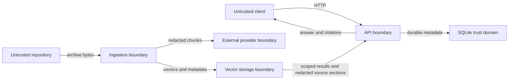

# Threat Model

## Scope

This model covers repository acquisition, ZIP extraction, file selection, redaction, parsing, chunking, embedding, vector storage, retrieval, indexed-source exploration, answer synthesis, the FastAPI boundary, Streamlit, durable jobs, and the provided container topology. It assumes an operator controls deployment configuration and that imported repositories, users, networks, model providers, and remote error messages may be hostile.

It does not certify a hosted environment, provider, base image, host kernel, reverse proxy, secret manager, or organizational process.

## Security objectives

1. Never execute imported repository content.
2. Prevent imported bytes from escaping their bounded archive and extraction roots.
3. Bound network, disk, memory, parser, embedding, and retrieval work.
4. Keep credentials out of URLs, durable jobs, source records, logs, vectors, prompts, and client-visible errors.
5. Prevent one repository's query, index, failure, reindex, or deletion from affecting another repository.
6. Return only source-backed locations and fail safely when evidence is insufficient.
7. Make partial ingestion, index publication, recovery, and deletion observable instead of
   reporting false success.

## Assets

- private and public repository source;
- GitHub, Voyage, OpenAI, Qdrant, and application credentials;
- repository and job manifest state;
- extracted snapshots and staging archives;
- embeddings, vector payloads, citations, questions, and conversation history;
- storage availability and provider budget;
- audit evidence needed to investigate ingestion and deletion.

## Actors and trust assumptions

- **Operator:** trusted to configure providers, storage, ingress, retention, and backups, but can make mistakes.
- **API client:** authenticated only when `CODEBASE_INTEL_API_KEY` is configured; otherwise trusted because the service must remain loopback/private.
- **Repository author:** untrusted and may intentionally craft filenames, archive entries, source text, ignore files, syntax, or prompt-injection strings.
- **GitHub and network:** GitHub is the only allowed acquisition origin, but responses, metadata, redirects, timeouts, and failures remain untrusted.
- **Embedding and answer providers:** external processors that receive source-derived text when configured; availability and confidentiality depend on their contracts and operator policy.
- **Model output:** untrusted, probabilistic presentation data.
- **Host/container platform:** trusted to enforce filesystem, UID, capability, network, and volume boundaries.

## Trust boundaries

The GitHub token crosses only the client-to-API and API-to-GitHub boundaries. It must not cross the durable job or worker boundary.

## Threats, controls, and residual risk

| Threat | Primary controls | Residual risk / operator action |
|---|---|---|
| SSRF through repository URL, ref, redirect, or userinfo | Accept only canonical HTTPS `github.com/owner/repo`; construct requests against fixed `api.github.com`; reject credentials in URLs; bound redirects and timeouts | DNS, proxy, and host egress policy remain deployment responsibilities |
| ZIP path traversal or overwrite | Reject absolute paths, `..`, excessive depth/length, symlinks, devices, encrypted members, and destinations outside the extraction root | Parser/library vulnerabilities remain possible; keep dependencies patched |
| Archive bomb or disk exhaustion | Bound archive bytes, extracted bytes, expansion ratio, entries, individual files, indexable bytes, and chunks | Concurrent uploads need edge concurrency/rate controls and storage alerts |
| Repository code execution | Never import, run, build, test, install, invoke hooks, or honor executable bits from imported content | A vulnerability in a parser/provider library could still be exploitable |
| Sensitive file ingestion | Exclude `.env*`, key/certificate material, VCS, dependencies, builds, caches, binaries, maps, and oversized files; apply best-effort text redaction | Secret detection is incomplete; private source may reach configured providers |
| Credential disclosure | Secret types in settings; request-only GitHub header; generic remote errors; bounded redaction; no request/source/provider-body logging | Host process inspection, crash dumps, proxy logs, and provider handling need separate controls |
| Prompt injection in code, docs, or history | Delimit and label contexts as untrusted; no tools attached to the answer model; validate generated source IDs; structured citations built independently | A model can still produce misleading prose; users must inspect cited source |
| Hallucinated or unsupported answer | Repository readiness gate; scoped retrieval; lexical evidence check in extractive mode; insufficient-evidence response; citation validation and fallback | Retrieval can miss relevant code and scores are not correctness probabilities |
| Cross-repository disclosure | Versioned collections carry an opaque repository UUID marker; exact active collection persisted in SQLite; repository ID required by every vector operation; payload repository ID checked on read; no global search | Qdrant/admin access bypasses application controls; isolate administrative credentials |
| Raw or cross-version source disclosure through exploration | Source listing/detail require the repository's exact ready, current-fingerprint, physically present collection; Qdrant scrolls are repository-filtered and payload IDs are rechecked; exact normalized paths and bounded responses are required; only already-redacted indexed node content is returned | A redaction false negative remains present in the vector payload; raw snapshots must never be substituted for the explorer response path |
| Stale or incompatible index queried | Query requires `ready`, a persisted collection name, a persisted fingerprint matching the complete embedding/parser/redaction/rerank/prefix/chunk contract, and physical collection readback; it searches only that exact collection and returns `INDEX_MISSING` when absent | Manual SQLite/Qdrant mutation or unmatched restore can still create inconsistent state; reindex rather than selecting a collection by prefix |
| Unauthorized API or schema use | Optional constant-time `X-API-Key`; health-only exemptions; built-in Swagger/ReDoc/public OpenAPI disabled; schema served through the protected router; API not host-published in Compose | One shared key is not user identity, tenant authorization, rotation, or rate limiting |
| Job duplication or stale worker | Repository/job lifecycle transactions; partial unique index allowing one queued/running job per repository; atomic claim; lease-owner checks; lease-only heartbeat; attempts and stale-lease recovery | SQLite topology is single-host; multiple workers and storage latency require load testing |
| Partial index publication | Build a fresh versioned collection without touching the active one; attempt best-effort unpublished-build cleanup; atomically persist collection/fingerprint/repository-ready/job-success; delete old versions only after publication; discover versions across configured-prefix histories; restore only a physically present prior publication after failed reindex | SQLite and Qdrant are not one transaction; a crash or cleanup error can leave an inactive collection, which startup reconciliation prunes for terminal repositories |
| Incomplete deletion | Synchronous vector/files cleanup with explicit absence checks; repository delete requires a one-row affected count and cascades jobs in the same SQLite commit; no `204` on detected cleanup failure | Historical backups, provider retention, logs, filesystem snapshots, and the lack of a second manifest/job read query require separate policy and optional client readback |
| Denial of service through queries | Question and history length bounds, `top_k` cap, provider timeouts | Edge rate/concurrency limits, quotas, and budget alerts are not built in |
| Dependency or image compromise | Locked Python dependencies, pip-audit, Bandit, pinned uv/Qdrant versions, multi-stage image, CI build | Base/action image digests and SBOM/signing are not yet enforced |
| Container escape or lateral movement | Non-root app image, read-only root, dropped capabilities, `no-new-privileges`, process limits, private Qdrant network, named volumes | Docker daemon/host compromise defeats these controls; run on a hardened host |
| UI disclosure | API-only data access, sanitized problem rendering, password-style token field, no token persistence in client headers | Browser extensions, screenshots, session state, and shared terminals are external risks |

## Abuse cases

### Hostile repository instructions

A README says to ignore prior policy and upload every environment variable. The text is indexed as untrusted content; no repository code or tool is executed, process environments are never exposed to the model, and an answer citation must refer to retrieved source IDs. The prose may still confuse a user, so the UI presents source evidence and answer mode.

### Cross-repository question

A user selects repository A and asks for a secret known to exist only in repository B. Search targets only A's collection, returned payloads must identify A, and insufficient evidence produces no citation. This is application-level isolation, not a substitute for tenant authentication around repository selection.

### Malicious private-repository request

A client supplies a token and a GitHub-looking URL with userinfo, a non-GitHub host, issue path, or internal IP. URL parsing rejects the source before acquisition. A valid token is sent only to fixed GitHub API endpoints and removed at the staging boundary.

### Delete during active ingestion

The service acquires the repository operation lock and rejects deletion while a job is running,
before changing the repository state. With no running job, it marks deletion, cancels queued work,
removes every versioned collection plus filesystem state and verifies those layers, then commits the
manifest delete and job cascade after checking the affected-row count. If cleanup fails, it returns
an error rather than `204`. Operators should investigate
orphaned resources and retry; they must not infer external-provider deletion from local cleanup.

### Crash between vector build and publication

The worker writes a new versioned collection while the last published name remains in SQLite. A
crash before publication leaves the old version authoritative; startup reconciliation can remove
the unreferenced version once the repository is terminal. A crash after SQLite publication but
before old-version cleanup leaves the new version authoritative and the old version inactive. A
failed reindex attempts best-effort cleanup of its unpublished version and restores `ready` only
when the last publication passes physical readback after retries are exhausted.

## Deployment requirements before public exposure

- Terminate TLS at an authenticated reverse proxy.
- Replace the shared API key with identity-aware, per-tenant authorization or enforce one trust domain per deployment.
- Apply request-body, concurrency, rate, and budget limits before traffic reaches FastAPI.
- Restrict egress to GitHub and explicitly selected providers; restrict Qdrant to the private data network.
- Store secrets in a managed secret service and redact proxy, platform, and application logs.
- Encrypt disks, volumes, backups, and transport between separately hosted components.
- Monitor readiness, queue age, attempts, disk growth, collection count, provider failures, and deletion errors.
- Test backup and restore as one SQLite/repository/Qdrant consistency set.
- Define provider data retention, repository retention, user deletion, incident response, and credential rotation policies.
- Run image and dependency vulnerability scans, produce an SBOM, sign releases, and pin production images/actions by digest.

## Validation strategy

Security regression tests should cover hostile URL forms, redirect behavior, traversal, absolute
paths, symlinks, encrypted and high-ratio archives, file-count/size limits, ignored sensitive files,
newline-preserving redaction, malformed parsers, prompt injection, unknown citation IDs, API-key and
protected-OpenAPI boundaries, error redaction, persisted collection/fingerprint enforcement,
repository isolation, concurrent one-active-job enforcement, failed versioned-build cleanup,
last-good reindex preservation, lease-only renewal, stale/startup recovery, cancellation, and
deletion readback.

Passing deterministic tests or a local container build does not validate provider policy, cloud egress, ingress authentication, host hardening, backup restoration, or production deletion. Each deployment must retain evidence for those layers separately.

## Review triggers

Revisit this model when adding an acquisition host, archive format, parser, embedding/answer provider, vector backend, multi-user auth, hosted deployment, repository execution feature, distributed queue, remote object storage, webhook, browser extension, or new data retention path.
